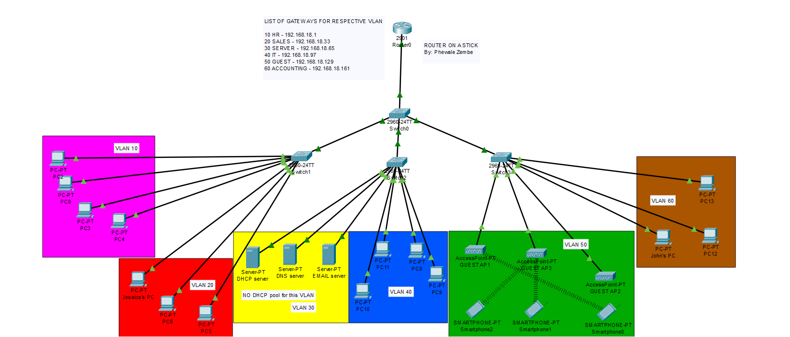
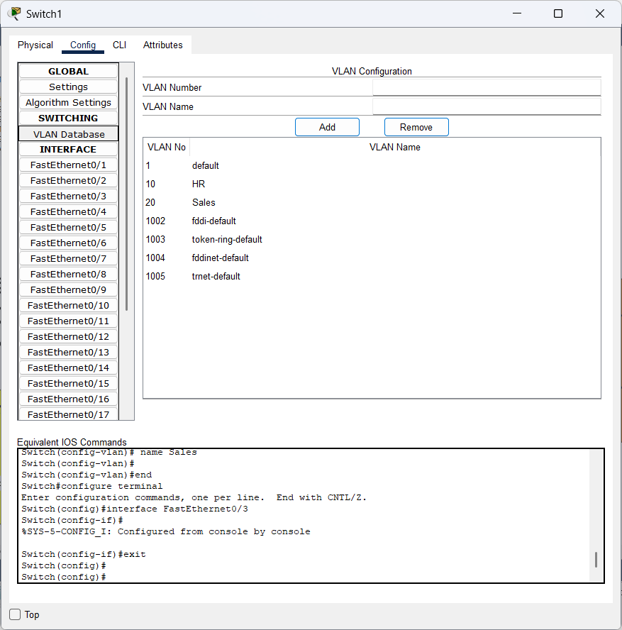
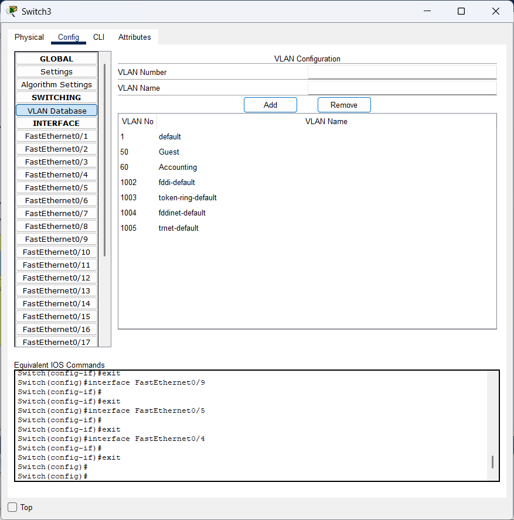
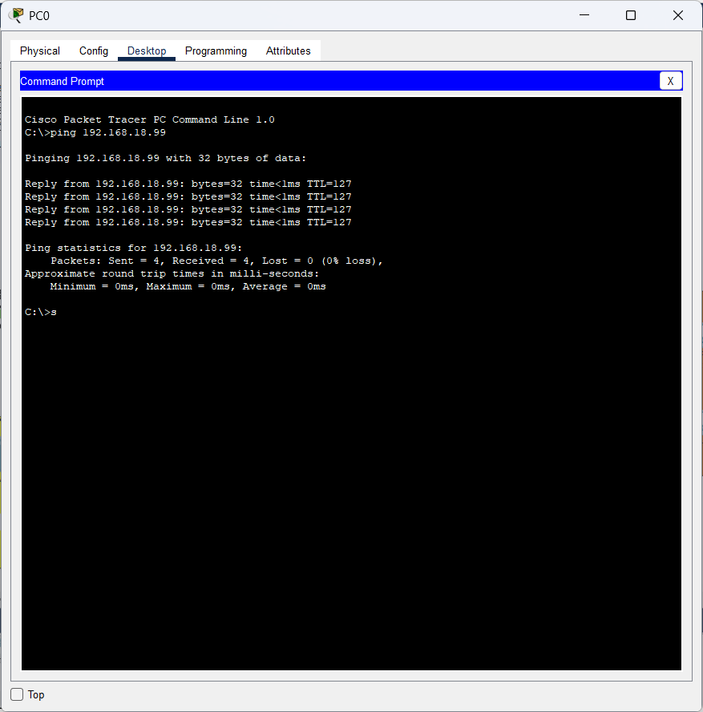
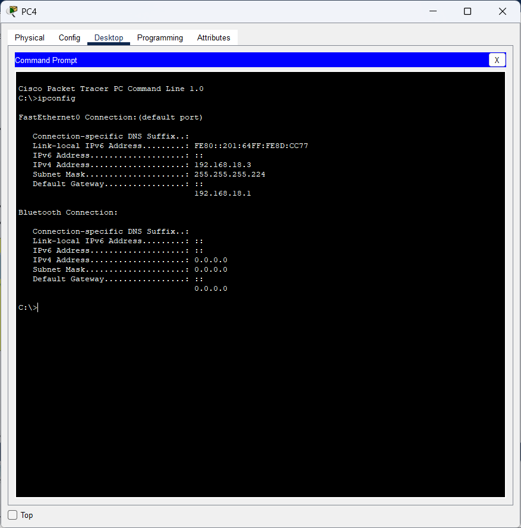
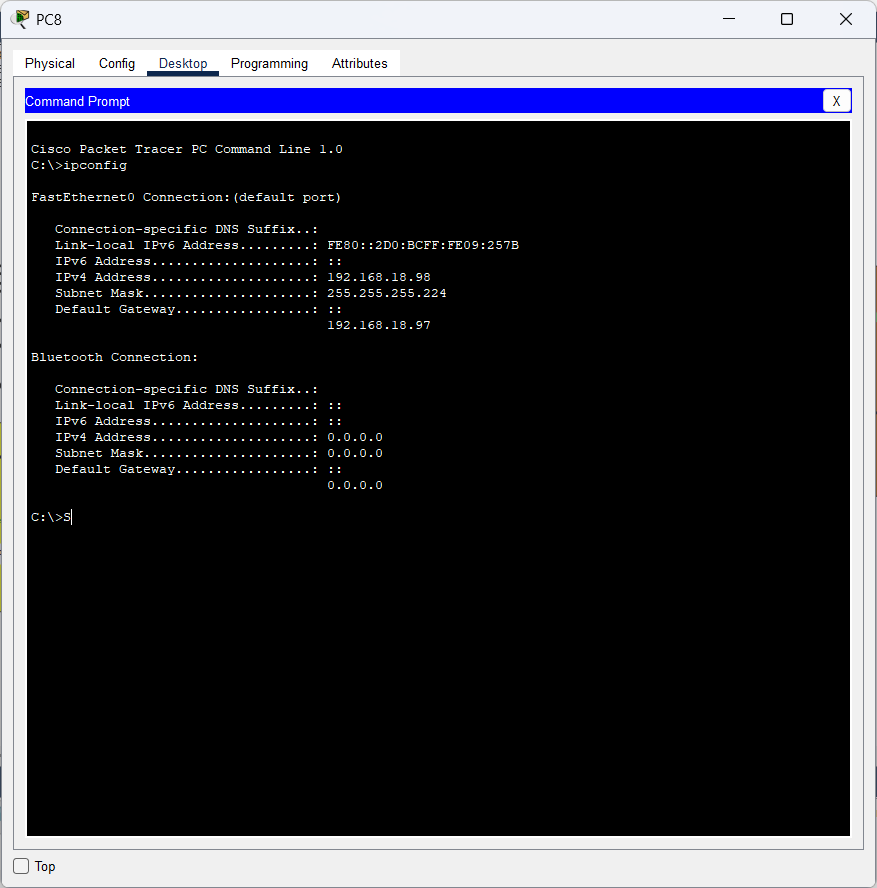
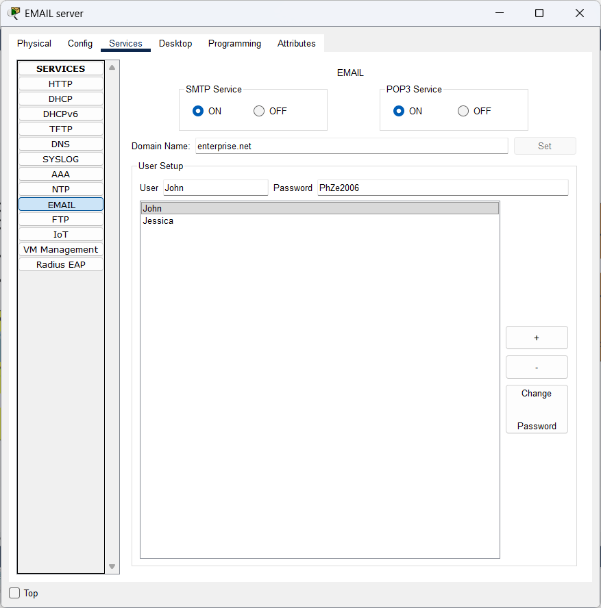
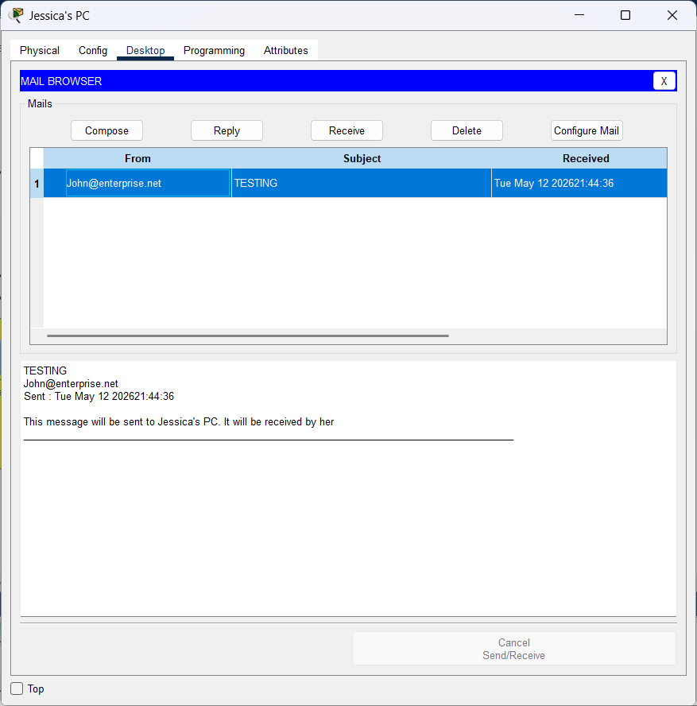
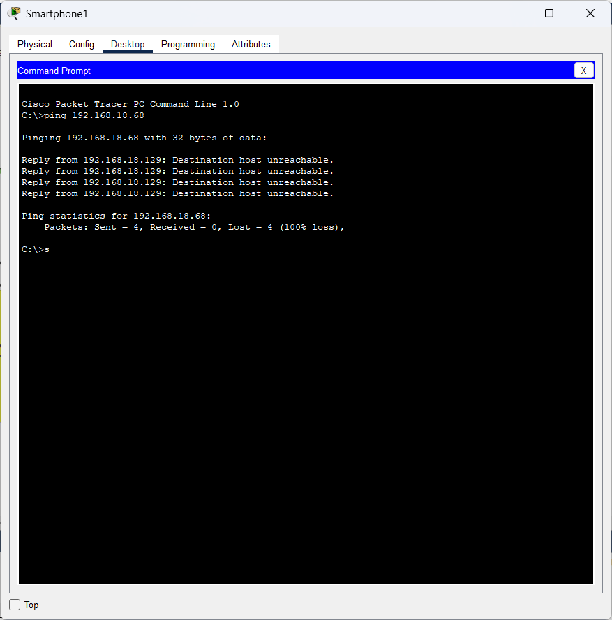
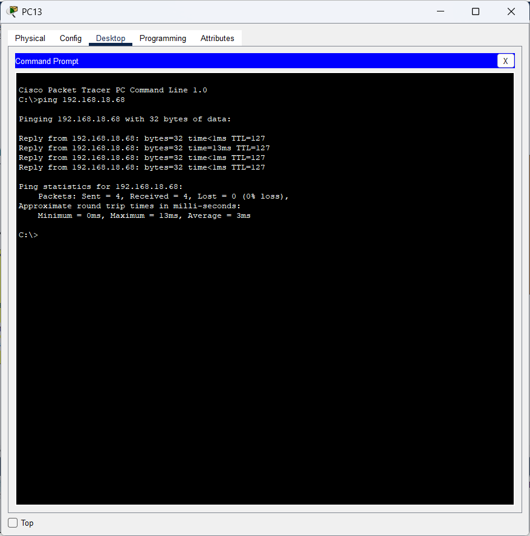

# Enterprise Network Infrastructure Simulation

## Important Note

Due to occasional simulation inconsistencies within Cisco Packet Tracer, some ping attempts may fail on the first attempt despite the network being correctly configured.

If a ping request appears to fail:
- attempt the ping a second time
- or inspect the packet flow using Simulation Mode

In some cases, Packet Tracer may initially display a failed communication attempt, but after verifying the packet path and returning to Realtime Mode, the status updates successfully.

---

## Overview

This project is a simulation of an enterprise network built using the tool Cisco Packet Tracer. which is freely avaliable and is used by those who wish to practice their networking skills.

The primary goal of this project was to strengthen and apply core networking and cybersecurity concepts through the design and implementation of a scalable enterprise-style network.

My project focuses on the following concepts:
- VLAN segmentation
- subnetting
- inter-VLAN routing
- DHCP relay
- ACL implementation
- centralized infrastructure services

The network simulates a small enterprise environment consisting of multiple departments, centralized servers, segmented access control, and wireless guest connectivity.

---

# Network Topology

---

# Objectives

- Implement VLAN segmentation between departments
- Configure inter-VLAN communication using a Router-on-a-Stick topology
- Configure centralized DHCP services for all hosts on the network
- Implement DHCP relay using the Cisco CLI command `ip helper-address`
- Configure DNS and Email services
- Apply ACLs to isolate guest traffic while only permitting DHCP communication
- Practice subnetting and structured IP addressing
- Simulate the design and implementation of a scalable enterprise-style network

---

# Networking Concepts Implemented

## VLAN Segmentation

Each department within the enterprise was assigned its own VLAN in order to isolate broadcast domains and organize traffic more efficiently.

Examples:
- HR Department → VLAN 10
- Accounting Department → VLAN 60

### VLAN Database Examples

---

## 802.1Q Trunking

802.1Q trunking was configured to allow traffic from multiple VLANs to traverse a single switch interface.

---

## Router-on-a-Stick

Inter-VLAN routing was implemented using a Router-on-a-Stick topology, where a single router interface handles traffic for multiple VLANs through the use of subinterfaces and 802.1Q encapsulation.

---

## Subnetting

The network `192.168.18.0/24` was subnetted into multiple smaller networks by increasing the number of bits used to identify the network to `/27`, therefore using the subnet mask `225.255.255.244`.

This allowed different departments and infrastructure services to operate within separate logical networks.

---

## DHCP and DHCP Relay

A centralized DHCP server located within the Server VLAN dynamically assigns IP addresses, default gateways, and DNS information to hosts across multiple VLANs.

Because DHCP broadcasts do not normally traverse VLAN boundaries, DHCP relay was implemented using the Cisco CLI command: `ip helper-address`

This allows DHCP requests received by the router to be forwarded directly to the centralized DHCP server.

Examples:
- PC4 belonging to VLAN 10 successfully receives an IP address dynamically
- PC8 belonging to VLAN 40 successfully receives an IP address dynamically

---

## DNS Service

A dedicated DNS server is available to all internal enterprise VLANs except for the Guest VLAN for security reasons.

---

## Email Service

A centralized Email Server was configured using the custom domain:`@enterprise.net`

In my project the PC names `John's PC` has sent an email which has been successfully received by jessica on her pc, `Jessica's PC`

---

## Wireless Infrastructure

The Guest VLAN consists of three wireless access points configured with the same SSID and password.

This allows wireless hosts to automatically connect to the nearest access point, simulating enterprise wireless roaming behavior.

---

# Cybersecurity Concepts Implemented

## Access Control Lists (ACLs)

ACLs were implemented to isolate the Guest VLAN from the rest of the enterprise network.

Hosts connected to the Guest VLAN are not permitted to communicate with internal enterprise networks. The only traffic allowed to leave the Guest VLAN is DHCP-related UDP traffic through ports 67 and 68.

All other traffic attempting to leave the Guest VLAN is denied.

This helps reduce the likelihood of the Guest VLAN becoming a pathway for unauthorized access or malicious activity targeting internal enterprise infrastructure.

In the screenshots below:
- a smartphone connected to the Guest VLAN is unable to communicate with the Email Server using ICMP
- PC13, which belongs to an internal enterprise VLAN, is able to communicate successfully unlike the smartphone

---

## Network Segmentation

Each department and infrastructure service was segmented into separate VLANs and subnets.

This was implemented not only for organizational and traffic management purposes, but also to support important cybersecurity principles such as:
- least privilege access
- attack surface reduction
- limiting unnecessary network exposure

For example:
- hosts within the HR department do not require unrestricted access to Accounting hosts
- critical infrastructure services such as DHCP, DNS, and Email are isolated within a dedicated Server VLAN resulting in attacks from the other VLANs having less of an effective the enterprise's critical infrastructure services

---